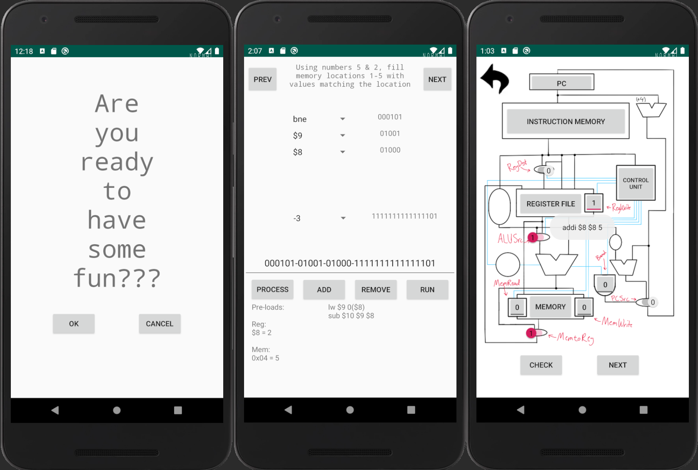
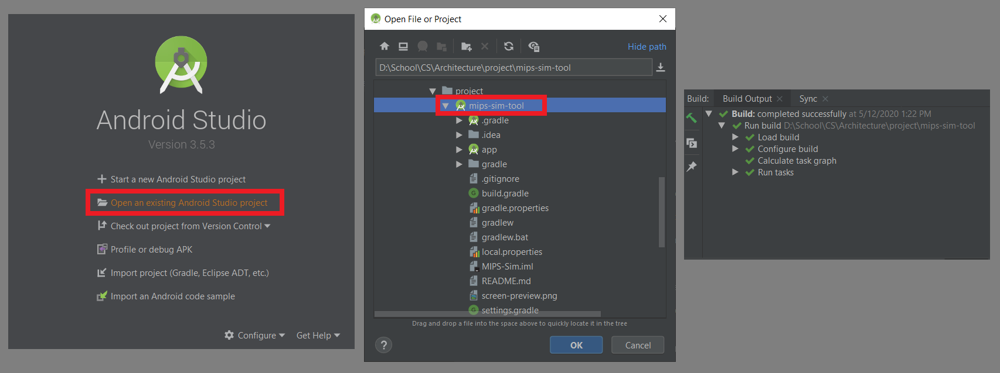

# mips-sim-tool
> This Android application was created as an assignment for a computer architecture class.
> It was designed to replicate the single-cycle data path of the MIPS architecture
> and to aid in learning the control signals thereof.
>
> However, i couldn't resist adding some gamification to the project....

> The application was created using compileSdkVersion 29.
> The targetSdkVersion is 29, but minSdkVersion 24.
> I have created the project in such a way that it should be easily extensible.

# how to get started
> With Android Studio you should have this application up and running in no time. The only default settings altered
> were the minSdkVersion.  This was raised to 24 for reasons that escape me, but i can assure that it was important.
> My Gradle settings are included in the package, so please double check your version before building.
>
> The steps for getting the project up and running are very simple. As you can see below, just loading the project
> in the order of the steps shown below resulted in an automatic build on my mobile workstation. 

