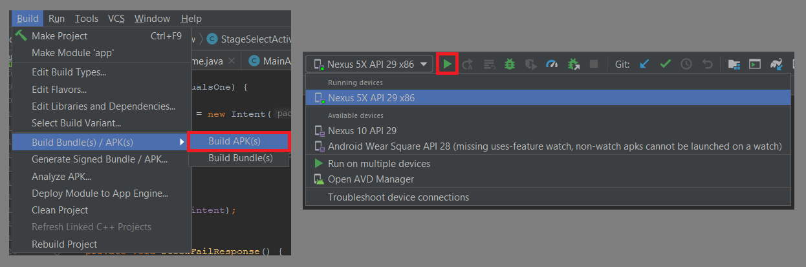

# mips-sim-tool
> This Android application was created as an assignment for a computer architecture class.
> It was designed to replicate the single-cycle data path of the MIPS architecture
> and to aid in learning the control signals thereof.
>
> However, i couldn't resist adding some gamification to the project....

# how to use
> The first couple challenges will quiz the users knowledge of which appropriate control signals
> are needed for each intruction set.  Hints are made available by clicking the "Control Unit" button.
> By completing preceeding challenges, the user can then move onto harder challenges. 
> The final challenge consists of objectives.  For these objectives the user is provided
> with a goal while being restricted in various way.  Whether by limited intruction access or by only
> using the supplied data, the user must create their own instruction set to complete the objective.

## features
* Three difficulty challenges
* Objective challenges (currently only 1, but more to come)
* Instruction encoding visualization

# how to run
> With Android Studio you should have this application up and running in no time. The only default settings altered
> were the minSdkVersion.  This was raised to 24 for reasons that escape me, but i can assure that it was important.
> My Gradle settings are included in the package, so please double check your version before building.
>
> The steps for getting the project up and running are very simple. As you can see below, just loading the project
> in the order of these steps shown resulted in an automatic build on my mobile workstation. 

> After building, you can then choose to build an APK and load it onto your Android device with developer options
> enabled, or simple use the built-in virtual device provided by Android Studio by clicking the play button and 
> following the instructions.

## afterword
> I'm not an artist so the artwork is a little rough.  And due to certain limitations with the current design
> the scaling for differing phone resolutions is satisfactory, but not ideal.  My hope is that future updates will
> address these issues.  Likewise, more objectives will be the longterm goal.  I even left implicit spots available
> for adding your own objectives. 
