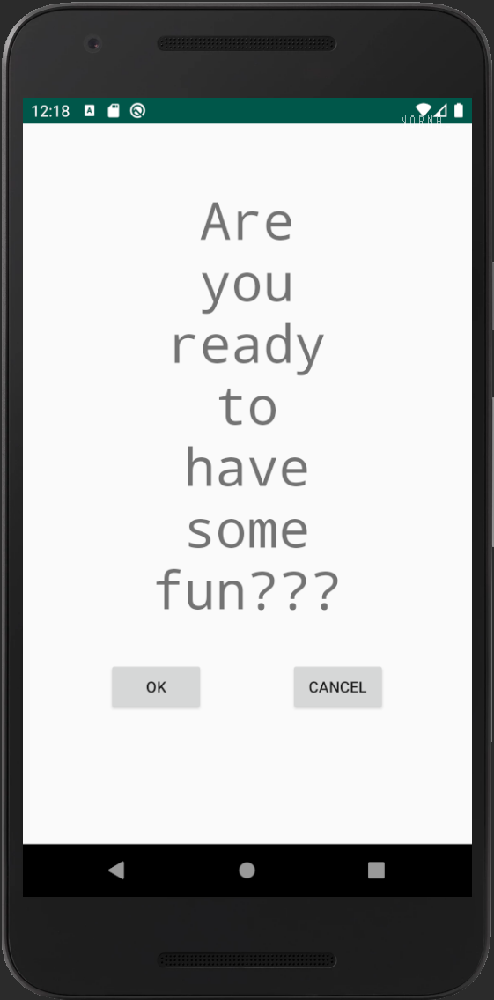
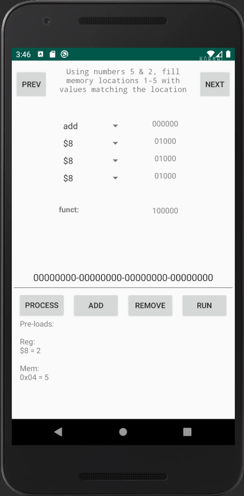
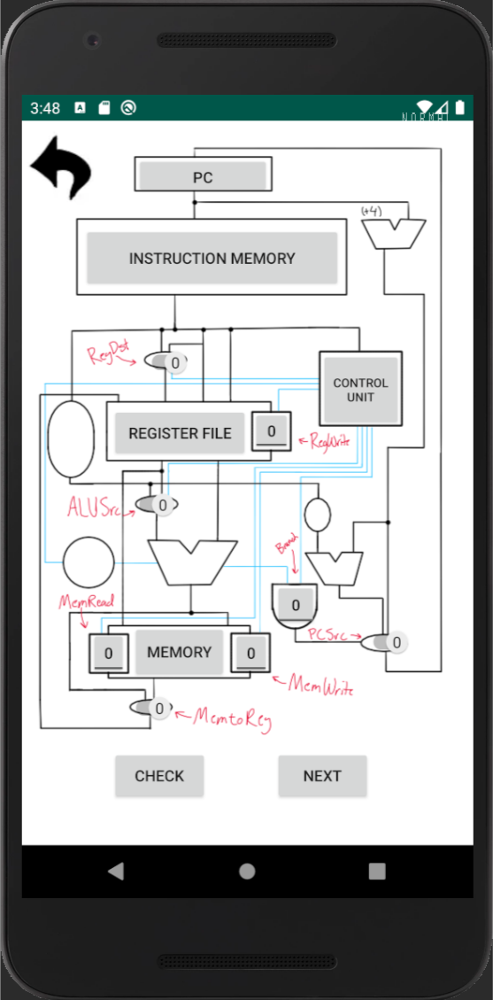

# mips-sim-tool
> This android application was created as an assignment for a computer architecture class.
> It was designed to replicate the single-cycle data path of the MIPS architecture
> and to aid in learning the control signals thereof.
>
> However, i couldn't resist adding some gamification to the project....

 

  

    
  

  

    
  

  

    
  

 

> The application was created using compileSdkVersion 29.
> The targetSdkVersion is 29, but minSdkVersion 24.
> I have created the project in such a way that it should be easily extensible.

# how to get started
> With Android Studio you should have this application up and running in no time. The only default settings altered
> were the minSdkVersion.  This was raised to 24 for reasons that escape me, but i can assure that is was important.
> My Gradle settings are included in the package, so please double check your compatibility before building
> (or just build and follow the recommended fix). If you are familiar with Android Studio, then these steps would come
> as no surprise. If not, don't fret.  Android Studio will cover the steps needed that i have missed.
